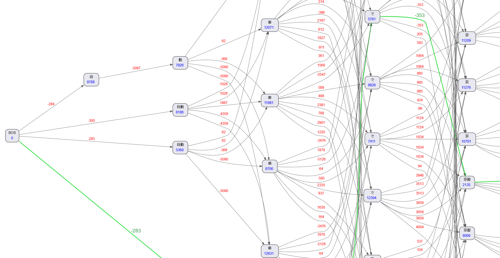

I think there are a lot of people who would like to contribute to an open source project, but don't know how and where to start, especially if it is their first time. It is even harder when English, in which communication about the project happens, is not your native language.

There aren't many stories online about how the process usually happens. A few days ago I found [this post by Tan Li Hau](https://lihautan.com/contributing-to-svelte-fixing-issue-4392/) about contributing to Svelte and thought it was a great idea to write in detail about what bug fixing or feature implementation looks like. So in this and upcoming posts I am going to tell you about how I contributed to some OSS projects. I hope this will encourage more people to contribute too.

This time I am going to talk about my first (and not last) contribution to [Gatsby](https://www.gatsbyjs.org/).

In my quest to get familiar with the (rather large) Gatsby codebase, I decided to look through some open issues and find one I could fix. Even before I could find a good one, I encountered a bug myself and decided to fix it right away. Here's [the issue I am going to talk about](https://github.com/gatsbyjs/gatsby/issues/21311).

## Background

I live and work in Japan and have to communicate with other frontend developers here. Although I don't write my posts in Japanese, I thought that someday I might want to and decided to check what a post will look like in Japanese. I noticed something strange: time-to-read display was way off the perceived value. There isn't one on this blog anymore but you can see it on the [Overreacted](https://overreacted.io/) blog, for example. The English counterpart of the same post showed twice as less time but felt close to reality. I realized that Japanese value just isn't true and there must be a problem with how `gatsby-transformer-remark`, the plugin that I use to render my Markdown posts, counts words... Right. Words. Words in English are separated by space, but not in Japanese. It's got to be the cause.

I was sure that I needed to look for the part where counting happens. So I dived into the code of `gatsby-transformer-remark`. Since it is an offical plugin, it is located inside the Gatsby monorepo.
By simply searching for `timeToRead` I quickly found the relevant code, which was pretty small. It is inside [`gatsby-transformer-remark/src/extend-node-type.js`](https://github.com/gatsbyjs/gatsby/blob/master/packages/gatsby-transformer-remark/src/extend-node-type.js):

```javascript
return getHTML(markdownNode).then((html) => {
  let timeToRead = 0;
  const pureText = sanitizeHTML(html, { allowTags: [] });
  const avgWPM = 265;
  const wordCount =
    _.words(pureText).length +
    _.words(pureText, /[\p{sc=Katakana}\p{sc=Hiragana}\p{sc=Han}]/gu).length;
  timeToRead = Math.round(wordCount / avgWPM);
  if (timeToRead === 0) {
    timeToRead = 1;
  }
  return timeToRead;
});
```

## Fixing the bug

Looks like someone already tried to deal with CJK word counting issue before. But why is it still wrong? I googled the [documentation](https://lodash.com/docs/#words) for `lodash`'s `words` function:

```plain
_.words([string=''], [pattern])

Splits string into an array of its words.

Arguments

    [string=''] (string): The string to inspect.
    [pattern] (RegExp|string): The pattern to match words.
```

It doesn't say much about what it does when the pattern matches so I just copy-pasted this line

```javascript
_.words("京都", /[\p{sc=Katakana}\p{sc=Hiragana}\p{sc=Han}]/gu);
```

into REPL inside the docs and checked the result. The result was `["京", "都"]` although 京都 is one word which means Kyoto in Japanese. Apparently `lodash` just splits the string whenever the pattern matches a **character**. This is completely wrong, because words can consist of more that one character. Well, I would be surprised if `lodash` DID count it correctly. But how can I fix it?

As you might have guessed, this is a very tricky problem, even in NLP (natural language processing) research. All kinds of machine learning is used to train a tokenizer that can correctly split a string into Japanese "words".



On my previous job I was involved in exactly this sort of work and know how tricky it can be. There IS a Javascript library called [kuromoji](https://github.com/takuyaa/kuromoji.js) that can parse Japanese strings, but it is not small and didn't really work at the moment of fixing the bug.

Clearly, we don't need a fully fledged morphological parser to deal with a single field inside a plugin. Moreover `kuromoji` only works with Japanese, but we also ideally want to support Chinese, to which different rules apply. This means we need heuristics.

A good way to check whether some heuristic is good is to make both your heuristic function and a real morphological parser work on the same string. After quite a bit of googling, I managed to find some small library `TinySegmenter` that [parses Japanese](http://chasen.org/~taku/software/TinySegmenter/) and just splits it into morphemes, nothing fancy. I used it to obtain the correct count against which I can check my heuristic.

So what does my heuristic look like?

First of all, it isn't easy to define a "word" in Japanese. A verb or an adjective can have many parts, some of which can be considered "words" on their own. However, a great lot of nouns consist of two characters like 京都 (Kyoto) above - 京 and 都. So the most naive heuristic would just count every character in a string and then divide it by two:

```javascript
const totalCount = _.words(latinChars).length + cjChars.length * 0.5;
```

This is what I did. Suprisingly, it showed numbers not that different from what a real parser showed. However on larger texts it still felt a bit off. This is because adjectives and verbs are usually longer than 2 characters. So I fine-tuned it and got the value `0.56`. Even on a blog post-sized text it was very close to the "real" value. Of course, we don't need the plugin to tell EXACTLY how much time it takes to read the post - that's not what we come for.

After converting the value to minutes by using the average words-per-minute constant (which I just decided to trust)

```javascript
const avgWPM = 265;
```

I got the amount of time that now was more or less the same as the English counterpart. Nice!

I still needed to figure out how to separate counts of Latin and Japanese (or, to be precise both Han and Hiragana/Katakana) characters. This is where I remembered. There is a set of Unicode ranges for all kinds of writing systems that I saw in [Eloquent Javascript](https://eloquentjavascript.net/), an amazing book on Javascript by Marijn Haverbeke, the book which I used to learn Javascript! It was a very interesting feeling to go back to it 2 years after.

[Here's the set of Unicode ranges](https://eloquentjavascript.net/code/scripts.js) I used. I picked Han, Hiragana and Katakana ranges from it and wrote a function that puts characters of a string into a separate array.

Here's what the final version in [the pull request that I submitted](https://github.com/gatsbyjs/gatsby/pull/21312) looks like:

```javascript
const sanitizeHTML = require(`sanitize-html`);
const _ = require(`lodash`);

// Unicode ranges for Han (Chinese) and Hiragana/Katakana (Japanese) characters
const cjRanges = [
  [11904, 11930], // Han
  [11931, 12020],
  [12032, 12246],
  [12293, 12294],
  [12295, 12296],
  [12321, 12330],
  [12344, 12348],
  [13312, 19894],
  [19968, 40939],
  [63744, 64110],
  [64112, 64218],
  [131072, 173783],
  [173824, 177973],
  [177984, 178206],
  [178208, 183970],
  [183984, 191457],
  [194560, 195102],
  [12353, 12439], // Hiragana
  [12445, 12448],
  [110593, 110879],
  [127488, 127489],
  [12449, 12539], // Katakana
  [12541, 12544],
  [12784, 12800],
  [13008, 13055],
  [13056, 13144],
  [65382, 65392],
  [65393, 65438],
  [110592, 110593],
];

function isCjChar(char) {
  const charCode = char.codePointAt(0);
  return cjRanges.some(([from, to]) => charCode >= from && charCode < to);
}

export const timeToRead = (html) => {
  let timeToRead = 0;
  const pureText = sanitizeHTML(html, { allowTags: [] });
  const avgWPM = 265;

  let latinChars = [];
  let cjChars = [];

  for (const char of pureText) {
    if (isCjChar(char)) {
      cjChars.push(char);
    } else {
      latinChars.push(char);
    }
  }

  // Multiply non-latin character string length by 0.56, because
  // on average one word consists of 2 characters in both Chinese and Japanese
  const wordCount = _.words(latinChars.join(``)).length + cjChars.length * 0.56;

  timeToRead = Math.round(wordCount / avgWPM);
  if (timeToRead === 0) {
    timeToRead = 1;
  }
  return timeToRead;
};
```

Before submitting the pull request, I also added the unit test for the `timeToRead` function and checked if my code is formatted.

## Next time

Next time I will talk about another contribution to Gatsby. In the meantime, if you liked the article, [follow me on Twitter](https://twitter.com/virtualkirill) for more updates!
