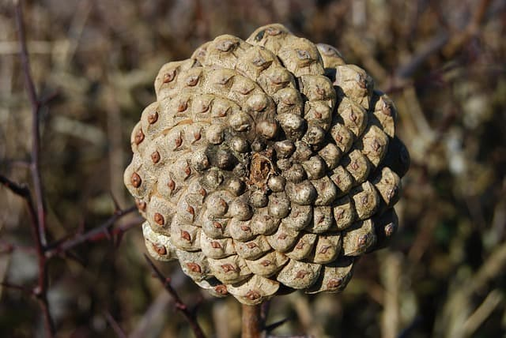
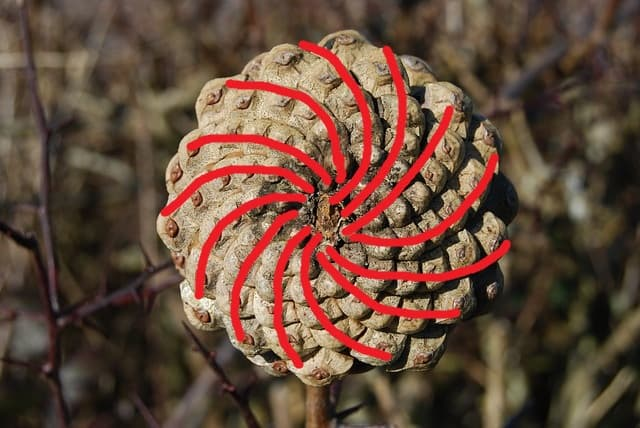
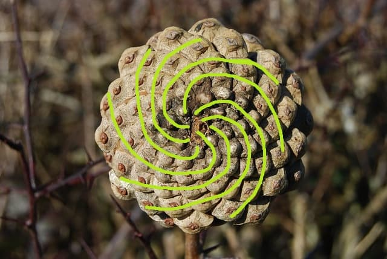
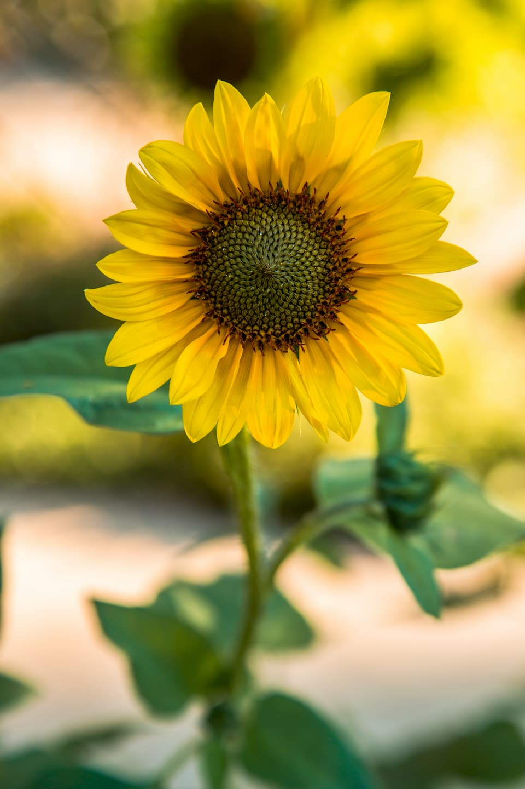

How many times have you picked up a pine cone and wondered why it has the shape it has? I never did. That was until I read an awesome book "Rhyme and Reason" by Juan Uriagereka while doing my Master's in linguistics. The book is not about pine cones, but it lists them as a peculiar example of how mathematical laws can govern the structure of living things. Look at this pine cone.

Do you notice something? If you look close enough you can see that seeds grow in spirals! In fact, there are two distinct sets of spirals in here. I highlighted them for you. Here's the first one:

And here's the second one:

What if I told you there's more to see here? Try counting the arms in both sets of spirals. There are 13 arms in the first image and 8 in the second one.
This is an example of what scientists call phyllotaxis. What makes these numbers special is that they are both part of Fibonacci sequence and are neighbors in it. In case you forgot what it looks like, here are the first numbers: 0, 1, 1, 2, 3, 5, 8, 13, 21, 34, 55... Basically, phyllotaxis is a special arrangement of seeds or leaves in plants. Although not always, the amounts of arms in phyllotactic spirals are often neighbours in Fibonacci sequence: 1 and 2, 2 and 3, 3 and 5, 5 and 8, 8 and 13 and so on. You can find the same pattern in sunflowers!

Why did nature "choose" this particular arrangement? Why don't you try to guess? Imagine that YOU can decide how pine cone seeds grow. How would you place them? The algorithm is something like this: place a seed, then rotate yourself by some degrees, then place another seed and repeat. For example, if you always rotate 360 degress (1 full turn) or don't turn at all the seeds will form a line. This is very far from a real pine cone.
Below, I created a playground where you can experiment with different degrees of rotation! Just input a number of turns that you think will get you the closest to the spirals in the pine cone. Remember, 1 turn = 360 degrees, so 180 degress is 0.5 turns etc.

The right answer is 0.618 (or 0.382 which is 1 - 0.618). Go back and try it. The value 1.618 is known as the Golden Ratio. It looks like the most space-efficient way to pack seeds (or leaves) is by turning golden ratio times each time before growing. In the context of turning, 0.618 turns is the same as 1.618 turns. How is it related to Fibonacci sequence? If you take two Fibonacci neighbours, like 8 and 13, and divide them such that the dividend is the larger one, you get a value that is very close to the Golden Ratio.
Note that the Golden Ratio is irrational. You can only get so close by using Fibonacci members. While the ratio is irrational it is amazing how the most physically space-efficient way to grow that the nature "chose" is describable with the language of mathematics.
