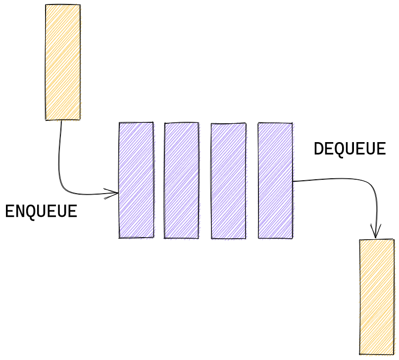

In this series I show the simplest way to build some data structures in Rust.

_These implementations are not guaranteed to be the most performant. I only guarantee that they work as they are intended to work theoretically. If you are looking for the most performant solution consider using libraries (crates)._

## What is a queue?

A queue is a very common data structure, which can be used in a variety of situations. It is needed for solving low level problems such as CPU job scheduling, but also for modeling a real-life queue - such as technical support requests that need to be processed in sequence. It is called Queue because it works exactly like a real queue: **first in - first out** (FIFO).

When we add something to a queue we say that we `enqueue` it. When we remove something from a queue we say that we `dequeue` it. Here's a simple model of how it works:



Like a [stack](https://www.kirillvasiltsov.com/writing/how-to-write-a-stack-in-rust/) it can be implemented using `Vec`.

## Create

First of all, let us define a `struct` and call it `Queue`:

```rust
struct Queue<T> {
  queue: Vec<T>,
}
```

We want our queue to be able to store different kinds of types so we make it generic by using `T` instead of any specific type like `i32`.

Now, to create a new queue we can do this:

```rust
let q = Queue { queue: Vec::new() };
```

But the more idiomatic way would be to define a new method for our queue, just like the one you used to create a new `Vec`:

```rust
impl<T> Queue<T> {
  fn new() -> Self {
    Queue { queue: Vec::new() }
  }
}
```

If you are not familiar with the `impl` (method) syntax you can read more about it [here](https://doc.rust-lang.org/book/ch05-03-method-syntax.html).

## Enqueue and dequeue

Both `enqueue` and `dequeue` are easy to implement. We can use methods that are available on `Vec`:

```rust
fn enqueue(&mut self, item: T) {
    self.queue.push(item)
}

fn dequeue(&mut self) -> T {
    self.queue.remove(0)
}
```

Dequeuing can be done with `remove` - a very handy method which shifts (moves) the remaining elements to the left. The first item in the array we use to implement the queue is the _head_ of our queue.

## Utility methods

There are some other methods that are associated with queues. They are `length`, `peek` and `is_empty`.

### length

Here we just reuse the `len` method of `Vec`.

```rust
fn length(&self) -> usize {
    self.queue.len()
}
```

### is_empty

Same for `is_empty`.

```rust
fn is_empty(&self) -> bool {
    self.queue.is_empty()
}
```

### peek

Here, again, we can use a very convenient method `first` that lets us take a look at the first item, or the head of our queue.

```rust
fn peek(&self) -> Option<&T> {
    self.queue.first()
}
```

Note that it returns a reference (`&`) and the reference itself is wrapped in an `Option`.

Now we have a functioning queue! Here's the full code:

```rust
struct Queue<T> {
  queue: Vec<T>,
}

impl<T> Queue<T> {
  fn new() -> Self {
    Queue { queue: Vec::new() }
  }

  fn length(&self) -> usize {
    self.queue.len()
  }

  fn enqueue(&mut self, item: T) {
    self.queue.push(item)
  }

  fn dequeue(&mut self) -> T {
    self.queue.remove(0)
  }
  fn is_empty(&self) -> bool {
    self.queue.is_empty()
  }

  fn peek(&self) -> Option<&T> {
    self.queue.first()
  }
}
```

And this is how you would you use it in code:

```rust
let mut queue: Queue<isize> = Queue::new();
queue.enqueue(1);
let item = queue.dequeue();
assert_eq!(item, 1);
assert_eq!(queue.is_empty(), true);
```

You can also [see the full code on my Github](https://github.com/jlkiri/rust-data-structures).
