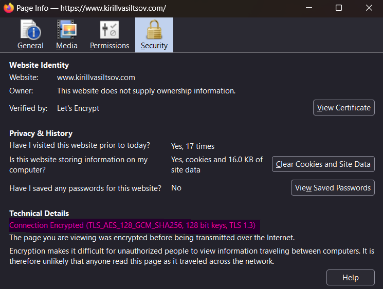
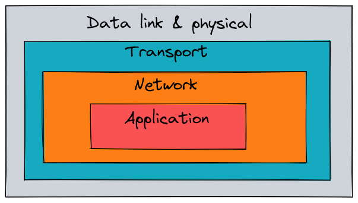
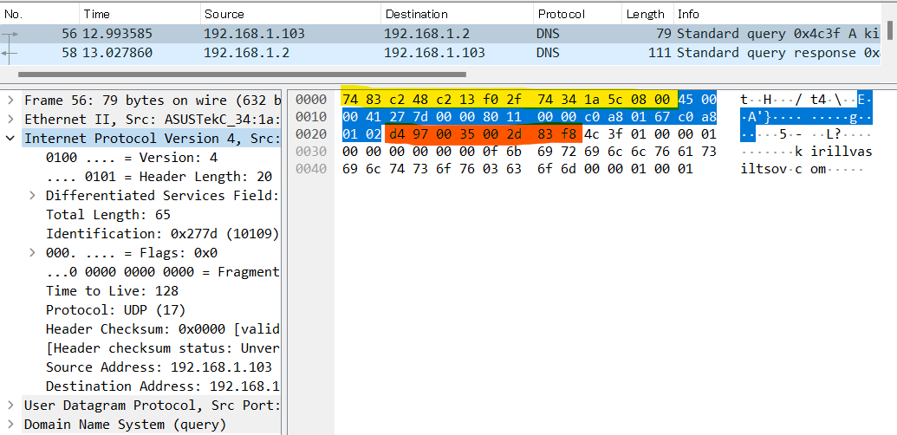

A lot of things happen after you type a URL in the address bar of your browser and press Enter, and before the browser can show the page to you. First of all, the browser needs to *resolve* the hostname part of the URL to an IP address of the web server. This is because other computers on the Internet are accessible by their IP addresses, not their names.



IP addresses look like this `172.217.175.78` (IPv4) or like this `2001:4860:4860::8888` (IPv6). The browser tries to learn both and then use an algorithm with a weird name ["Happy Eyeballs"](https://en.wikipedia.org/wiki/Happy_Eyeballs) to decide which to use for better performance. In fact you can skip the domain name resolution altogether and just type the IP address directly if you know it.


The mapping from the (sub)domain to the address could be right in the browser's cache, but sometimes the browser needs to get the answer elsewhere. For example, in your operating system's cache or even from a remote DNS ([Domain Name System](https://en.wikipedia.org/wiki/Domain_Name_System)) server, which is also called a *nameserver*. DNS is also the name of the protocol that is used to query these specially designed servers and find out which (sub)domains map to which IP addresses. A protocol is a language that two computers on the network can understand and DNS is just one of the many. Your OS likely has an API that applications like a browser can use to send DNS queries to the Internet. For example, the [`getaddrinfo`](https://man7.org/linux/man-pages/man3/getaddrinfo.3.html) function from [C library](https://en.wikipedia.org/wiki/C_standard_library), which has many other useful functions used by both applications and the operating system. If your OS does not find the answer in its DNS cache either, it sends a DNS query to the configured nameserver. The query asks the server for the A (or AAAA) record, which is an entry in the database that maps the (sub)domain to an IPv4 (or IPv6) address.


Yet another way to resolve the domain name is [mDNS](https://en.wikipedia.org/wiki/Multicast_DNS) (Multicast DNS). In some cases, like when the top-level domain is `.local`, the computer would send a special message to every device on the LAN that asks "whoever has this domain name - tell me your IP address". If some device indeed has the domain name in question it sends its IP address in the response to your computer. Sending to every device on LAN is possible by using a *multicast* IP address.

 
How does your computer know the address of the DNS server? You might have configured it manually (like [`8.8.8.8`](https://developers.google.com/speed/public-dns)) or it might have been configured automatically by [DHCP](https://en.wikipedia.org/wiki/Dynamic_Host_Configuration_Protocol) (Dynamic Host Configuration Protocol), which is also used by your computer to get its own IP address from your LAN (or your ISP's) router. Once the nameserver's IP address is known, the operating system opens a [UDP](https://en.wikipedia.org/wiki/User_Datagram_Protocol) *socket*, a special entity (an actual file in Linux) that is used to communicate on the network. The socket is assigned a *port* number from 1024 to 65535 that identifies the socket locally. The remote server has a similar open UDP socket but with a port number 53. UDP is a transport-level protocol that is used to "carry" higher-level messages like DNS queries over the Internet. 

I know what you are thinking: "That's a lot of protocols!". And you are right, because there are more, so buckle up for the ride. 

Quite a few things happen before the UDP messages called *datagrams* reach the nameserver and before the response comes back to your computer. Because getting the actual page from the web server is a similar process, I return to it in detail below. For now, imagine that the nameserver successfully received your query. The nameserver might not have an answer for you, in which case it forwards the query to other nameservers and those nameservers can repeat the process until the *authoritative* nameserver for that domain either gives you the answer or just says "I don't know" and ruins your day. Suppose the address exists and `getaddrinfo` function used by your browser returns with an IP address, which the browser can finally use to send the request for the page.

To get a web page, browsers use [HTTP](https://developer.mozilla.org/en-US/docs/Web/HTTP) and [HTTPS](https://en.wikipedia.org/wiki/HTTPS). HTTP is an application-level protocol that makes it easier to express requests like "I want a resource at path `/cats.html`"  or "Save this user's data at path `/users`". It would be almost impossible to make this a part of a transport-level protocol. The browser assumes that there is an HTTP server listening for requests at the IP address it just learned. That server usually has an open [TCP](https://en.wikipedia.org/wiki/Transmission_Control_Protocol) socket with port number 80 or 443. TCP, like UDP, is the transport-level protocol which usually "carries" HTTP messages, though it can be used to "carry" DNS as well. The browser needs to only create a valid HTTP (or HTTPS) request that looks like this, literally:

```
GET / HTTP/1.1
Host: github.com
``` 

It contains a verb (`GET`) that reflects what the browser wants to do, the path of the resource (`/`), the protocol version used (`HTTP/1.1`) and the `Host` header that is a (sub)domain name. There is a bunch of other headers that can reflect the user's preference for a certain language of the page (`Accept-Language` header), information that identifies the user (`Cookie` or `Authorization` header) etc.

Then the browser asks the operating system to open a TCP socket and send the HTTP(S) request to the IP address of the server and port 80 or 443 (which is usually expressed together as `172.217.175.78:80`). The browser does not need to know how to create TCP messages (called *segments*) at all - that is handled by the implementation of the TCP/IP stack that is part of any major operating system. The OS creates the first TCP segment and sets the source and destination port numbers along with some other useful information like sequence number to guarantee ordered delivery. It would be a mess if the verb `GET` became `EGT` in the process. The sequence number is needed because a single application-level message can be too big to fit in a data link layer frame, which usually has a maximum size of about 1500 bytes. Because of this limit transport layer segments very often need to be split into many small ones.

The sequence number only makes sense within a single *connection*, which is a transport layer concept. This means that two devices on the network must first establish a connection and only then exchange messages. In TCP connections are created through a *three-way handshake*. First, your computer sends a TCP segment with its flag field set to `SYN`. The web server responds with a TCP segment with a flag `SYN-ACK` and finally your computer sends the `ACK` segment as the response. After that your computer and the web server are ready to exchange messages. Like I said, even delivering the first segment is a lot of work so read further.

Nowadays web servers often only expect HTTPS messages at port 443, designed for *encrypted* communication. This prevents eavesdropping which is very easy with plain HTTP thanks to traffic analyzers like `tcpdump` or Wireshark (see some examples below). HTTPS is basically HTTP that enables privacy by adding another layer of communication - [TLS](https://en.wikipedia.org/wiki/Transport_Layer_Security) (Transport Layer Security). TLS relies on [public key cryptography](https://en.wikipedia.org/wiki/Public-key_cryptography) for creating a private session between the client and the server. TLS version 1.3 uses the [X25519](https://en.wikipedia.org/wiki/Curve25519) algorithm to make two computers exchange their public keys and then agree on some shared secret that will be used to encrypt (and decrypt) individual HTTP messages (or other application data). 


This secret relies on some [symmetric encryption](https://en.wikipedia.org/wiki/Symmetric-key_algorithm) algorithm, like [AES](https://en.wikipedia.org/wiki/Advanced_Encryption_Standard). For example, AES is used when you access [this blog](https://www.kirillvasiltsov.com/).





This key exchange happens via the TLS handshake which takes only one round trip from the client to the server.

Simply encrypting your communication channel is not enough. The browser needs to know if it can trust whoever it is about to talk to, so it checks the validity of the [TLS certificate](https://aws.amazon.com/what-is/ssl-certificate/) that is sent in a `ServerHello` response during the handshake. This certificate contains the server's public key and is  itself encoded with the public key of some [certificate authority](https://en.wikipedia.org/wiki/Certificate_authority) (CA) that your browser/computer trusts *a priori*. Not all certificates are valid all the time - they can expire or be revoked. Because of this, the browser sometimes needs to use [OCSP](https://en.wikipedia.org/wiki/Online_Certificate_Status_Protocol) (Online Certificate Status Protocol) to send a request to the CA's server and verify that the TLS certificate is valid.

If everything is alright, the TCP connection and the secure TLS channel is established.

Once the connection is established the browser encrypts the first HTTP request and sets the now-encrypted HTTPS request as the TCP segment's payload. Then the operating system "wraps" this TCP segment in an IP *packet* and sets the source and destination addresses along with other useful information like protocol version (4 or 6). This is a good time to point out that IP itself is a protocol. After all IP is an abbreviation of *Internet Protocol*! This is the level at which routing across networks happens and allows your packet to reach the destination. Finally, the OS "wraps" the IP packet in an [Ethernet](https://en.wikipedia.org/wiki/Ethernet) *frame*. Ethernet is a lowest, link layer protocol that uses [MAC addresses](https://en.wikipedia.org/wiki/MAC_address) to send messages between [NICs](https://en.wikipedia.org/wiki/Network_interface_controller) (Network Interface Controller) of two or more devices. The OS uses the driver software of the network interface (which is called something like `eth0` on your computer) to send the Ethernet frame as physical signals.


You are probably noticing some pattern. The system keeps wrapping, or *encapsulating* things into other things. This is the known as the TCP/IP model of networking. The TCP/IP model organizes protocols in layers such that each layer is only concerned with its own "job": data link layer only needs to deliver (and verify integrity of) Ethernet messages by MAC address within a LAN. Network layer is concerned with routing IP packets (which encapsulate link layer messages) across networks separated by routers. Transport layer can provide retransmission of lost network layer packets and their order. Application layer can be used for whatever you want.



A message at every layer begins with a header that is just a bunch of bytes in certain order. These bytes have special meaning that is defined in a RFC. For example, IP packet headers include information like protocol version and total length of contents before the source address field. TCP segment headers include information like segment number, source/destination port number, window size etc. In the screenshot below, I used Wireshark to analyze my own traffic. I ran a `dig` command to resolve my blog's domain name `kirillvasiltsov.com` to an IP address. You can see encapsulation in action: Ethernet header is marked with yellow, IP header with blue, UDP header with orange and the rest is DNS header + message.




Up until now we assumed that our IP packets containing TCP/TLS handshake messages magically reach the web server. Before we look at the HTTP exchange, we need to clear up how the first TCP connection initiation segment that is sent out of your computers's network interface even reaches the destination. Well, most home computers only have one network interface so there is only one way out anyway. While your computer is not a router, it has a routing table that it uses to make routing decisions too. The decision making is the same for all devices - if the destination IP address is not in your subnet (which is usually your whole home network) then send the message to the *default gateway*. The default gateway is your router and both its IP address and MAC address is what your computer learns via DHCP at some point during the boot.


If you have several computers on your LAN connected with a switch, then if you try to access some web page hosted on one of those computers, the HTTP request will not go through the router but go directly to the neighbor. How can the message find its way? Your computer, like a router, has [ARP](https://en.wikipedia.org/wiki/Address_Resolution_Protocol) (Address Resolution Protocol) cache. ARP is yet another protocol that is used to learn MAC addresses of devices that have a particular IP addresses. So when you send a HTTP request to a local web server with an IP in your subnet, your OS checks the ARP table to set the correct destination MAC address, which is then used by the switch to forward the message out of the correct network interface.


Suppose that the web page you want to see is hosted by a server in a remote network. The router checks for an existing route in its routing table. If there is no exact match, the router makes a similar decision to your computer - forward the packet out of its own default gateway. The router usually has only one way out to the WAN (Wide Area Network) too, so it just forwards the packet to your ISP's router on the other side, using its *default route* `0.0.0.0/0` with an associated network interface. This route is used for all destinations that your router does not know (not directly connected or learned from other routers in the network). Before the router even makes the decision it needs to unwrap (or *de-encapsulate*) the Ethernet frame and read the IP packet to know where it is headed. After that, the router creates a new Ethernet frame, sets its own source MAC address, wraps the IP packet and sends it out of the chosen network interface.

Next, it is your ISP's job to make sure the IP packets reach the correct destination. Your ISP is probably a very big network with many ways in and out. But even then, it is likely that the web server is not directly connected to that network. It could be on the other continent! However, ISPs do not have a "default route" because there is no hierarchy between [autonomous networks](https://en.wikipedia.org/wiki/Autonomous_system_(Internet)) (called *autonomous systems*) on the Internet. Instead autonomous systems choose to exchange NLRI (Network Layer Reachability Information) which is basically the list of subnets reachable from that network. [BGP](https://en.wikipedia.org/wiki/Border_Gateway_Protocol) (Border Gateway Protocol) is another protocol used by AS to exchange this kind of messages. The ISP's routers probably have a matching entry in their BGP routing table (which is synchronized across literally all routers on the ISP's network via iBGP). Your request is forwarded through the correct router. Then it passes through as many AS as needed until it finally reaches the web server.

BGP exchange does not happen *during* the request so I will not go deeper and I frankly don't know much more anyway.


It is also possible that the IP address that the domain name resolved to is not really the web server's address. Very often there is more than one server *instance* with the same software to spread the burden of processing requests. Because of this, web server instances have a load balancing reverse proxy in front of them that proxies TCP connections to the proper instance's IP address that remains private. The IP address you get though is the IP address of the reverse proxy. So strictly speaking, the process of choosing the best proxy target (such as round robin) also takes place during the request.


Now that it is clear what route the TCP and TLS handshake messages take, we can look at the HTTP request/response exchange.

The server's machine receives Ethernet frames destined for the machine's MAC address. The server's operating system de-encapsulates the frame and looks at the IP packet. If there are no internal firewall rules that ban IP packets from certain addresses, the system de-encapsulates the IP packet and reads the TCP segment. If it appears to be out of order, the system does not send an `ACK` response until it receives all segments and potentially waits for the client to re-transmit the lost segment. If everything is OK, the system puts the TCP segment in the TCP receive buffer. If the buffer is full it send the TCP response with a window size set to `0` meaning that the server is busy and cannot receive TCP segments right now.

At the same time the OS notifies the process listening at the port that matches the destination port in the segment that there is TCP data to receive. The process reads the data from the buffer until there is nothing left (`EOF`) and processes it as the software engineer intended.

In this case, the TCP data can be either of the following:

* HTTPS message encrypted using the shared secret that two parties agreed on earlier during the TLS handshake
* plain HTTP message forwared from the reverse proxy if the proxy is configured to *terminate* TLS connections

Suppose we receive the plain HTTP request that the browser sent.

```http
GET / HTTP/1.1
Host: github.com
```

The server parses the request and applies some logic based on the verb and path (and other headers if present). For example it might check whether the user is authenticated and authorized to access the resource. Depending on the request, the server crafts an HTTP response that looks something like this:

```http
HTTP/1.1 200 OK
content-type: text/html; charset=utf-8
cache-control: max-age=0, private, must-revalidate
set-cookie: _gh_sess=...; path=/; secure; HttpOnly; SameSite=Lax

<body>
```

The response always includes the [status code](https://developer.mozilla.org/en-US/docs/Web/HTTP/Status). In this case it's `200` which means OK. It may include other headers like `cache-control` that tell the browser (or the caching servers along the way) whether to cache the response for some time. In the example above the server asks to not cache the response at all. Another header is `content-type` that specifies the format and encoding of the body. In this case your response includes an HTML page as its body. The server program (or the library it uses) asks the OS to encapsulate the response in one or more TCP segments by using a [send()](https://man7.org/linux/man-pages/man2/send.2.html) system call. These TCP segments have a destination port number chosen by the client earlier as its source port number. The operating system then puts the segments into the TCP send buffer. Segments in the buffer are ultimately encapsulated in IP packets with the server instance's IP address as the source address. Then the IP packets are encapsulated in Ethernet frames and sent out of the network interface.

The response tracks the similar route out of the server instance's network as the route that your request took. When it reaches the browser's machine, the system de-encapsulates the Ethernet frames, the IP packets and the TCP segments. All segments with the destination port that matches the port the browser asked the OS to open are forwarded to the browser's process. The browser's code is responsible for reading the appropriate buffer until `EOF` (until there is nothing to read). Those bytes represent an encrypted HTTPS response.

The browser uses the shared secret agreed on earlier during the TLS handshake to decrypt the response. Then the encrypted bytes are parsed as HTTP. If the `content-type` header happens to be `text/html` the browser starts to parse the response body as HTML. It starts with the `<head>` element. Usually a web page contains a few links to the page's *asset* files like CSS or JavaScript. As soon as the browser discovers a `<link rel="stylesheet">` to a CSS file or a `<script>` tag with JavaScript inside or a `src` attribute link to the JavaScript file, it blocks *rendering* until the CSS can be downloaded and JavaScript downloaded and executed. To download asset files the browser opens new TCP connections that follow the similar proccess we saw earlier. In some cases (which I am not sure about) the same TCP connection can be re-used.

The assets do not necessarily live on the same server as the page. Often the resources are served from a [CDN](https://en.wikipedia.org/wiki/Content_delivery_network) (Content Delivery Network).


The single TCP connection is re-used for assets when [HTTP/2](https://en.wikipedia.org/wiki/HTTP/2) is used, by specification. Interleaving multiple response's TCP segments, or *multiplexing*, is one of the advantages of HTTP/2.

