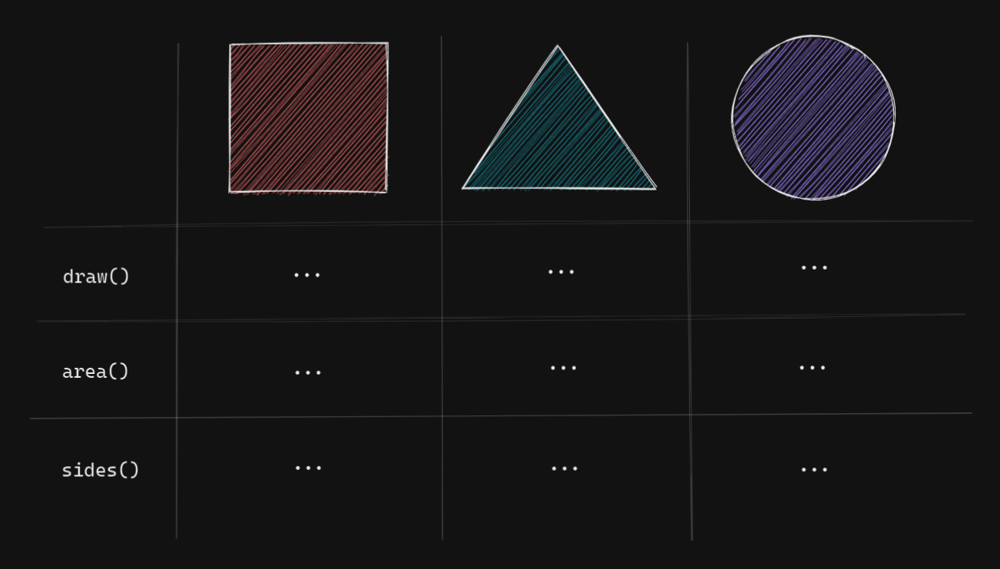
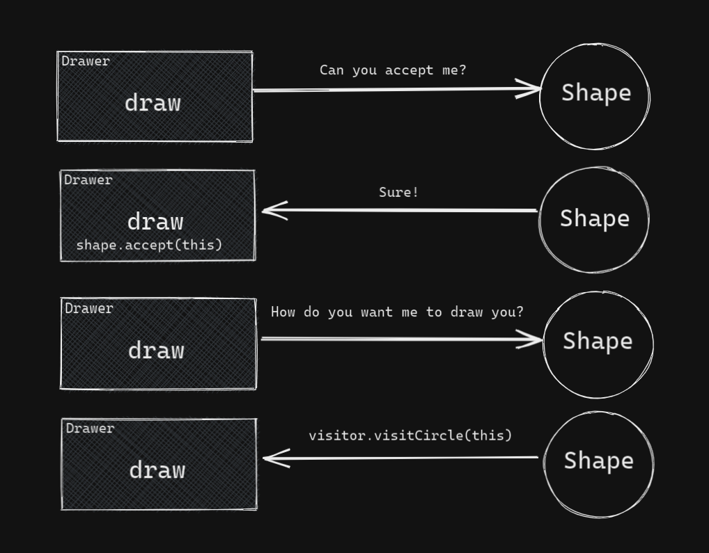

Imagine that you are writing a program that can draw different shapes: circles, triangles, squares, etc. You represent them by corresponding data types. Depending on a language you use, these shapes become distinct classes, structs, members of an enum or parts of some algebraic data type. Because you also want to be able to do something with these shapes, you describe that behavior somewhere. For example, if you chose to represent shapes as classes, behavior can be described as methods on these classes. Suppose you decide to support one basic behavior: drawing.

The goal of this article is not to show you some quick way to make your shapes drawable and call it a day. Instead, before we implement an outline of such a program, let's think about how we could structure our code. Let's start with a simple table of our shapes and their (possible) behavior.



Somewhere in our code we just want to call `draw()` and watch it magically draw a correct shape depending on which option is currently selected. We definitely don't want to concern ourselves with the details of drawing in the same place we handle a user's click. But each shape is drawn differently so we need to describe the behavior three times -- once for each shape. If we had _four_ shapes, we would need to describe the behavior _four_ times.

Like I said, where _exactly_ we have to describe this behavior depends on the language we choose. Some languages allow for more than one way to do this and deciding which is _better_ is no easy task. It was even called the "The Expression Problem" and Bob Nystrom has [a nice short explanation in his book Crafting Interpreters](https://craftinginterpreters.com/representing-code.html#the-expression-problem). The "problem" refers to the fact that when we have a lot of shapes AND a lot of behaviors, some languages require us to do a lot of work just to add a new shape and some languages require us to do a lot of work just to add a new behavior. There is no easy compromise. However (as you probably already have guessed) there is a design pattern that makes our lives easier in such situations -- the Visitor pattern.

JavaScript and TypeScript are among those languages which give us a little bit more freedom than others. Today I want to talk specifically about TypeScript because it makes some type-safe patterns like the Visitor pattern possible and useful in an otherwise dynamic language.

So, in TypeScript we have a bunch of ways to achieve what we want, but not all of them are good. Assume we have three classes that represent our shapes.

```ts
class Square {}
class Circle {}
class Triangle {}

type Shape = Square | Circle | Triangle
```

The bad way would be to just have a single `draw()` function and use conditions to find out how to draw a particular shape:

```ts
function draw(shapes: Array<Shape>) {
  for (const shape of shapes) {
    if (shape instanceof Square) {
      // draw Square
    } else if (shape instanceof Circle) {
      // draw Circle
    }
  }
}
```

The problem with this approach is that it is **not** type-safe. The compiler does not tell us that we forgot to handle the `Triangle` case. This will cause a runtime error when we try to draw a `Triangle`. Note that in languages with pattern matching like Haskell or Rust, the compiler would warn us about unhandled cases.

One type-safe alternative is to define a `Drawable` interface. `interface` here means roughly the same thing it means in many other OOP languages.

```ts
interface Drawable {
  draw: () => void
}
```

Now if we slightly modify our `draw` function to expect an array of `Drawable` things, not just `Shape`s, we will get a compile error if we try to pass it an array that contains something that does not implement `draw()`.

```ts
class Square {
  draw() {}
}

class Triangle {}

function draw(shapes: Array<Drawable>) {
  for (const shape of shapes) {
    shape.draw() // Square, etc...
  }
}

draw([new Triangle()]) // Compile error!
```

Good. Even better if we force every shape to `implement` it which is another nice thing possible in TypeScript!

```ts
class Square implements Drawable {
  draw() {}
}

class Circle implements Drawable {
  draw() {}
}

class Triangle implements Drawable {
  draw() {}
}
```

Imagine at some point we decide to support one more behavior -- area calculation with `area()`. This is where we run into the "Expression problem" I mentioned above. First we would need to define a new interface:

```ts
interface Area {
  area: () => number
}
```

and make _each_ shape implement it in addition to `Drawable`!

```ts
class Square implements Drawable, Area {
  draw() {}
  area() {}
}

class Triangle implements Drawable, Area {
  draw() {}
  area() {}
}
// omitted
```

So how can we reduce the amount of code we have to touch every single time we add a new behavior? How can we make sure that we didn't forget to handle a particular behavior on a particular share? Meet the Visitor pattern.

## Visitor pattern

There are probably many ways to explain this pattern. I think that it is easy to understand it from the point of view of the bad example I gave in the beginning of the article. Let me repeat it here.

```ts
function draw(shapes: Array<Shape>) {
  for (const shape of shapes) {
    if (shape instanceof Square) {
      // draw Square
    } else if (shape instanceof Circle) {
      // draw Circle
    }
  }
}
```

What if there was a way to group all possible cases in one place, just like we grouped conditions in one function? Here's one such way:

```ts
interface ShapeVisitor {
  visitCircle(shape: Circle): void
  visitSquare(shape: Square): void
  visitTriangle(shape: Triangle): void
}
```

`visit` is a weird word, but in this context it basically means "handle". Just in case you want to complain, know that I am not the one who came up with the pattern. Now, a class that implements this interface is a class that must have all of these methods which describe concrete steps needed to draw a shape. To make sure some class implements all of these "handlers" we can just use the `implement` keyword. Only classes can `implement` things in TypeScript so instead of a function we create a class, `Drawer`, whose responsibility is to draw.

```ts
class Drawer implements ShapeVisitor {
  visitCircle(shape: Circle) {}

  visitSquare(shape: Square) {}

  visitTriangle(shape: Triangle) {}
}
```

Remember, our goal here is to get rid of the need to add new behavior to each class. This means our old interface `Drawable` with a `draw` method won't do. Let us change `Drawable` interface to this:

```ts
interface Drawable {
  accept(visitor: ShapeVisitor): void
}
```

What is `accept`? That's just another convention of this pattern. You can name it anything you want but `accept` makes it clear that you are trying to follow the pattern. This method's job is to take the visitor and then _choose_ which of the visitor's methods we should use to draw this particular shape. Let's implement `Drawable` for one of our shapes:

```ts
class Square implements Drawable {
  accept(visitor: ShapeVisitor) {
    visitor.visitSquare(this)
  }
}

// similar for every other shape
```

This finally allows us to add a `draw` method to `Drawer`.

```ts
class Drawer implements ShapeVisitor {
  /* visit functions */

  draw(shape: Drawable) {
    shape.accept(this)
  }
}
```

Quite a lot of indirection but hopefully now you see how it works. Somewhere in our code we draw a shape a like this:

```ts
const drawer = new Drawer()
drawer.draw(new Square())
```

Now if we decide to support one more shape, e.g. a `Star`, we don't have to add code for every possible behavior to this new class. Instead we make it visitable and then implement the details in relevant visitors. The visitors, of course, will need to have a new method, like `visitStar`. We would start with adding it to the interface `ShapeVisitor` to make sure that every class that `implements` it has a `visitStar` method.

```ts
interface ShapeVisitor {
  visitCircle(shape: Circle): void
  visitSquare(shape: Square): void
  visitTriangle(shape: Triangle): void
  visitStar(shape: Star): void
}
```

This is type-safety that we could not have with a bunch of conditions.

The names `visit` and `accept` are not completely random, though, if you picture what's happening.



Sometimes it's best to just read the whole code so here's what we have written so far:

```ts
interface Drawable {
  accept(visitor: ShapeVisitor): void
}

interface ShapeVisitor {
  visitCircle(shape: Circle): void
  visitSquare(shape: Square): void
  visitTriangle(shape: Triangle): void
}

class Drawer implements ShapeVisitor {
  visitCircle(shape: Circle) {}

  visitSquare(shape: Square) {}

  visitTriangle(shape: Triangle) {}

  draw(shape: Drawable) {
    shape.accept(this)
  }
}

class Square implements Drawable {
  accept(visitor: ShapeVisitor) {
    visitor.visitSquare(this)
  }
}

class Circle implements Drawable {
  accept(visitor: ShapeVisitor) {
    visitor.visitCircle(this)
  }
}

class Triangle implements Drawable {
  accept(visitor: ShapeVisitor) {
    visitor.visitTriangle(this)
  }
}
```

You may have noticed that there is no need to call the `Drawable` interface `Drawable`. That is true. `ShapeVisitor` can be implemented by many different classes, not just `Drawer` but also `Filesystem` or `Animate` or whatever. We want to be able `accept` all of them without editing every shape class. That's why it probably makes sense to just call it `VisitableShape` or something.

## Caveats

If you are a sharp reader, you probably noticed that nothing prevents us from doing this:

```ts
class Triangle implements Drawable {
  accept(visitor: ShapeVisitor) {
    visitor.visitSquare(this) // Attention here.
  }
}
```

I expected it to work out of the box like in some other languages, but it didn't. This is something I couldn't find a workaround for, so if you know, let me know!
